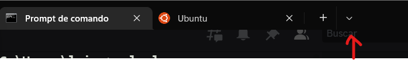
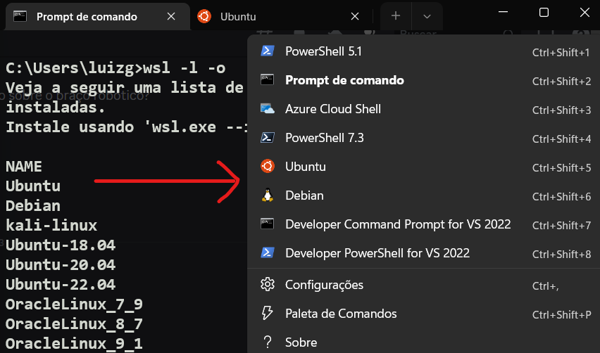

## Início
Basicamente esse repositório serve para ensinar a instalar a biblioteca raylib no wsl do windows, fazendo assim ficar mais fácil usar a lib, sem precisar ficar programando no notepad++. 
Primeiro teremos os passos de instalar o wsl no win10/11 e depois os passos serão dentro do terminal do Ubuntu.
## Instalando e configurando o WSL
Basicamente para instalar o terminal linux, teremos apenas que colocar o comando `wsl --install` no terminal, esse comando irá instalar o wsl, que em resumo é uma maquina virtual que irá rodar uma distro linux dentro do sistema windows, mais informações só clicar [aqui](https://learn.microsoft.com/pt-br/windows/wsl/install).
Com o wsl instalado temos de especificar a distro a ser instalada, no caso o Ubuntu, para isso usamos simplesmente o comando `wsl --install -d Ubuntu-22.04`,  isso irá instalar a distro e irá pedir algumas informações como nome de user e senha, esse será o usuário que você usará no terminal.
Para ver quais outras distros podem ser instaladas é só usar o comando `wsl -l -o` e executar o comando acima só indicando o nome da distro a ser instalada, mais informações [aqui](https://learn.microsoft.com/pt-br/windows/wsl/basic-commands).
Com o Ubuntu instalado no wsl, se você estiver usando apenas o prompt/powershell para acessar ele é só digitar o comando `wsl` que o terminal irá trocar e ficar semelhante ao da distro escolhida, mas usando o aplicativo Terminal do windows mesmo, que agrupa todos os terminais da maquina, a distro escolhida irá aparecer aqui, como uma opção de janela:


Só clicar no terminal escolhido(no caso da imagem temos instalado o Debian e o Ubuntu) e ele irá abrir uma janela do terminal com o respectivo.
O wsl está instalado mas ele por si só não poderá suportar uma interface gráfica, indispensável para ver como está o jogo desenvolvido em raylib, para usar interfaces gráficas no wsl a microsoft disponibiliza drivers que quando instalados permitem abrir aplicativos de linux no windows pelo wsl, esses drives podem ser encontrados [aqui](https://learn.microsoft.com/pt-br/windows/wsl/tutorials/gui-apps), ,só seguir esse tutorial que vai funcionar.
Em alguns casos não se precisa instalar os drivers só colocar o comando `wsl  --update` oque vai atualizar o wsl e depois `wsl --shutdown` para reiniciar o wsl.
Com o drives instalado podemos partir para configurar as coisas no ubuntu e de cara recomendo a quem não é familiarizado com o uso do terminal pesquisar e estudar mais sobre, mas [aqui](https://www.hostinger.com.br/tutoriais/comandos-linux) você irá encontrar um geral dos principais comandos, todos obviamente podem ser executados no terminal com wsl.
Além de tudo isso é importante configurar o Visual Studio Code para usar dentro da distro instalada pelo wsl, isso é simples, apenas instalamos a extensão de nome WSL, da própria Microsoft, ela fara a conexão quando inicializarmos o vs no terminal do Ubuntu.

## O Ubuntu(Mesmo para quem não irá usar WSL)
Aqui será explicado como "instalar" a biblioteca raylib, oque não é mais difícil doque instalar o WSL, mas é importante ter algum conhecimento de git e comandos de terminal, já que não se tem uma interface gráfica certinha para ir se guiando; Todos os comendos basicamente foram automatizados por esse repo, mas eles podem ser achados [aqui](https://terminalroot.com.br/2022/11/crie-jogos-para-windows-linux-e-web-com-raylib-c-cpp.html).
Antes de tudo precisamos atualizar o sistema usando o comando `sudo apt update && sudo apt upgrade`.
Depois disso precisamos instalar 3 coisas no Ubuntu, o git, um pacote com ferramentas "essenciais" para programação e uma forma de se conectar com o vscode, isso pode ser feito pelo comando:
```
sudo apt install build-essential git wget
```
##### (por ser um comando que usa sudo ele irá pedir a senha do seu user no Ubuntu).
Com o git instalado é só você clonar esse repo, com o comando:
```
git clone https://github.com/Zed201/Projeto_Base_Jogo_IP.git
```
 Depois disso você entra na pasta, com o cd normalmente e pode abrir o vscode, usando o comando `code .` no terminal, mas basicamente você tem que, dentro da pasta clonada, digitar o comando `. ./inst.sh` , isso irá iniciar um script que irá instalar tudo oque for preciso, só precisa ser feito uma vez na maquina(no caso por distro).
Uma vez isso feito pode abrir o vscode nessa pasta e executar o comando `make` e se tudo tiver certo ele irá compilar o código e mostrar um exemplo do uso da raylib.
## Um pouco mais
O arquivo "Makefile" desse repositório servirá para facilitar os comandos de compilação dos códigos que usam raylib, recomendo até dar uma olhada, basicamente usar o comando `make` fará o código ser compilado, sendo colocado numa pasta chamada Build, e executado; O comando `make rm` irá excluir essa pasta e o comando `make ex` irá apenas executar o codigo já compilado.
Os outros arquivos desse repo basicamente são um gitignore básico, quem sabe mexer com git sabe oque ele faz, o index.c que é o codigo de exemplo a ser compilado(inclusive se for mudar o nome de arquivo deve editar o "Makefile" para ele compilar o arquivo certo), esse readme.md e as suas imagens o script .sh que pode ser excluído uma vez que já foi usado.

